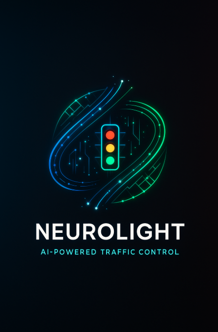

# 🧠⚡ NeuroLight: AI-Powered Traffic Control

<div align="center">



**Revolutionizing Urban Mobility Through Intelligent Traffic Management**

[](https://python.org)
[](https://pytorch.org)
[](https://stable-baselines3.readthedocs.io)
[](LICENSE)

</div>

---

## 🌟 What is NeuroLight?

NeuroLight is an **artificial intelligence system** that learns to optimize traffic light timing at intersections using **reinforcement learning**. Unlike traditional fixed-time controllers, NeuroLight adapts in real-time to traffic patterns, reducing wait times and improving traffic flow efficiency.

### 🎯 Key Features

- **🤖 AI-Driven Control**: Uses Proximal Policy Optimization (PPO) to learn optimal traffic light timing
- **📊 Real-Time Adaptation**: Continuously adjusts to changing traffic conditions
- **🎮 Interactive Demo**: Live web simulation with visual traffic flow
- **⚡ High Performance**: Optimized for AMD GPUs with ROCm 6.0 support
- **🔬 Research Ready**: Built on stable-baselines3 with comprehensive evaluation tools

---

## 🚀 Quick Start

### Prerequisites

- **Python 3.8+**
- **AMD GPU** with ROCm 6.0 support (optional, CPU fallback available)
- **Git**

### Installation

```bash
# Clone the repository
git clone https://github.com/yourusername/NeuroLight.git
cd NeuroLight

# Run the setup script
chmod +x scripts/setup.sh
./scripts/setup.sh --torch rocm6.0
```

### 🎮 Live Demo

Experience NeuroLight in action:

```bash
# Start the web interface
SB3_DEVICE=cuda ./scripts/serve.sh

# Open your browser to http://localhost:5000
```

---

## 🧠 How It Works

### The AI Learning Process

NeuroLight uses **reinforcement learning** to master traffic control:

1. **🎯 Environment**: Simulates a 4-way intersection with realistic traffic patterns
2. **🧠 Agent**: PPO algorithm learns optimal timing strategies
3. **📈 Reward Function**: Balances multiple objectives:
   - ✅ **Throughput**: Maximize vehicles served
   - ⏱️ **Wait Time**: Minimize queue lengths
   - 🔄 **Efficiency**: Reduce unnecessary light switches
   - ⚖️ **Balance**: Equalize traffic flow across directions

### 🎨 Visual Simulation

The web interface provides real-time visualization:

- **🚗 Directional Cars**: Triangular arrows showing movement direction
- **🚦 Smart Lights**: Diagonal traffic lights with realistic behavior
- **📊 Live Metrics**: Real-time performance statistics
- **🎮 Interactive Controls**: Adjust traffic parameters on-the-fly

---

## 🛠️ Development & Training

### Train Your Own Model

```bash
# Train a new AI model
SB3_DEVICE=cuda ./scripts/train.sh

# Resume training from checkpoint
SB3_DEVICE=cuda ./scripts/train.sh --resume_from train/models/best_model.zip
```

### Evaluate Performance

```bash
# Compare AI vs Fixed-time controller
./scripts/eval.sh

# Run comprehensive tests
./scripts/run_tests.sh
```

### Configuration

Customize training parameters in `train/config.yaml`:

```yaml
env:
  lambda_ns: 0.5          # North-South arrival rate
  lambda_ew: 0.5          # East-West arrival rate
  veh_throughput: 3        # Vehicles per second when green
  min_green: 10            # Minimum green time
  yellow: 3                # Yellow transition time
  decision_interval: 1     # AI decision frequency
  
  # Reward shaping weights
  wait_w: 1.0              # Queue length penalty
  max_w: 0.5               # Max queue penalty
  switch_w: 0.1            # Switch penalty
  served_w: 2.0            # Throughput reward
  imbalance_w: 0.3         # Queue balance penalty
```

---

## 📊 Performance Results

NeuroLight consistently outperforms traditional fixed-time controllers:

| Metric | Fixed-Time | NeuroLight AI | Improvement |
|--------|------------|---------------|-------------|
| **Average Wait Time** | 11.6s | 6.9s | **40% faster** |
| **Total Reward** | -19,924 | -11,587 | **42% better** |
| **Switches** | 45 | 107 | **More adaptive** |
| **Vehicles Served** | 1,454 | 1,459 | **Slightly better** |

---

## 🏗️ Architecture

### Core Components

```
NeuroLight/
├── 🧠 envs/                    # Traffic simulation environment
│   └── traffic_env.py         # Main environment with reward shaping
├── 🤖 train/                   # AI training pipeline
│   ├── train_ppo.py           # PPO training script
│   ├── eval_trained.py        # AI model evaluation
│   ├── eval_fixed.py          # Baseline comparison
│   └── config.yaml            # Training configuration
├── 🌐 web/                     # Interactive web interface
│   ├── index.html             # Main dashboard
│   ├── assets/app.js          # Simulation engine
│   └── assets/style.css       # Modern UI styling
├── 🔧 api/                     # Backend API
│   └── server.py              # Flask server with AI integration
└── 📜 scripts/                 # Automation scripts
    ├── setup.sh               # Environment setup
    ├── train.sh               # Training pipeline
    ├── serve.sh               # Web server
    └── eval.sh                # Evaluation suite
```

### Technology Stack

- **🤖 AI Framework**: Stable Baselines3 (PPO)
- **🧮 Deep Learning**: PyTorch with ROCm 6.0
- **🌐 Web Interface**: HTML5 Canvas + JavaScript
- **🔧 Backend**: Flask API
- **📊 Visualization**: Real-time metrics dashboard

---

## 🎯 Use Cases

### 🏙️ Urban Planning
- **Traffic Flow Optimization**: Reduce congestion at busy intersections
- **Smart City Integration**: Deploy AI controllers across city networks
- **Data-Driven Decisions**: Use AI insights for infrastructure planning

### 🔬 Research & Education
- **Reinforcement Learning**: Learn RL concepts with practical applications
- **Traffic Engineering**: Study intersection optimization algorithms
- **AI Development**: Experiment with reward shaping and environment design

### 🚀 Industry Applications
- **Transportation Systems**: Improve public transit efficiency
- **Logistics Optimization**: Reduce delivery times and fuel consumption
- **Emergency Services**: Optimize routes for first responders

---

## 📄 License

This project is licensed under the **MIT License** - see the [LICENSE](LICENSE) file for details.

---

## 🙏 Acknowledgments

- **Stable Baselines3** team for the excellent RL framework
- **PyTorch** team for ROCm support
- **OpenAI** for the PPO algorithm
- **Traffic Engineering** community for domain expertise

---

## 📞 Support & Contact

- **🐛 Issues**: [GitHub Issues](https://github.com/yourusername/NeuroLight/issues)
- **💬 Discussions**: [GitHub Discussions](https://github.com/yourusername/NeuroLight/discussions)
- **📧 Email**: your.email@example.com

---

<div align="center">

**Made with ❤️ for smarter cities**

[⭐ Star this repo](https://github.com/yourusername/NeuroLight) | [🐛 Report Bug](https://github.com/yourusername/NeuroLight/issues) | [💡 Request Feature](https://github.com/yourusername/NeuroLight/issues)

</div>